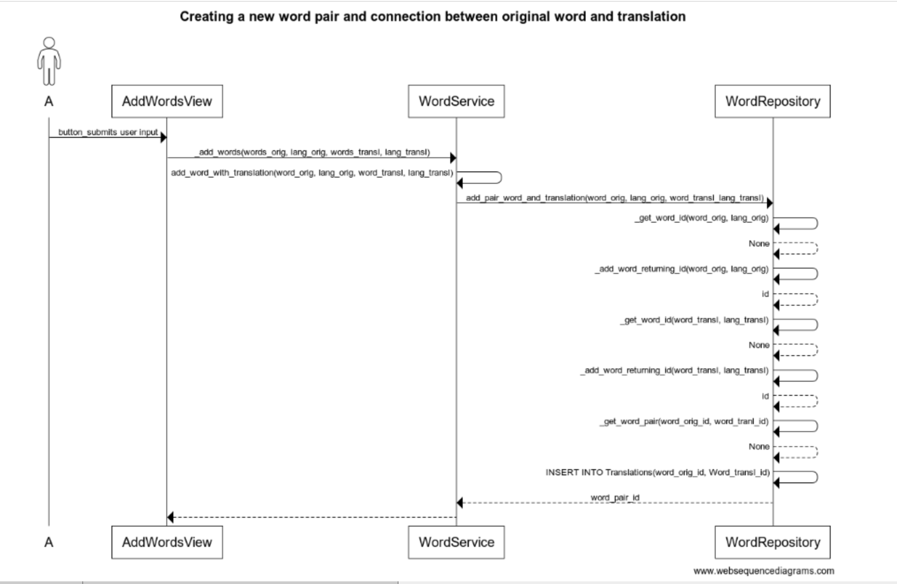

# Arkkitehtuurikuvaus

## Rakenne

Ohjelman rakenteena on kolmitasoinen kerrosarkkitehtuuri.

**Koodin pakkausrakenne:**

Pakkaus ui sisältää käyttöliittymästä vastaavan koodin.

Pakkaus services sisältää sovelluslogiikasta vastaavan koodin.

Pakkaus repositories sisältää tietojen pysyväistallennuksesta vastaavan koodin.

Pakkaus entities sisältää sovelluksen tietokohteita kuvastavat luokat.

## Sovelluslogiikka

Sovelluksen loogisen tietomallin muodostavat luokat Person, Practice ja Word
kuvaten käyttäjää, sanaparin harjoittelun edistymistä ja yksittäistä sanaa.

**Toiminnallisista kokonaisuuksista vastaavat luokat:**

PracticeService tarjoten metodit luokkien UI ja PractiseView toiminnoille.

UserService tarjoten metodit luokkien MainView, RegisterView ja LoginView toiminnoille.

WordService tarjoten metodit luokan AddWordsView toiminnoille.

## Luokkakaavio

## Sekvenssikaavio 

