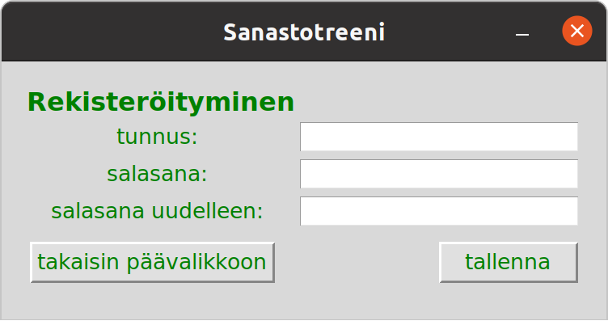

# Käyttöohje

### Ohjelman käynnistäminen:

Ennen käynnistämistä, asenna riippuvuudet komennolla:

```bash
poetry install
```

Käynnistä ohjelma komennolla:

```bash
poetry run invoke start
```

### Sovelluksen käyttäminen:

## Sovellus käynnistyy päänäkymään


Sanastoa voi harjoitella myös ilman kirjautumista siirtymällä sanaston harjoittelunäkymään painamalla ‘HARJOITTELE’ -painiketta.

## Sanaston harjoittelu ilman kirjautumista


**Sanaston harjoittelu**
- valitse ensin vasemmalta puolelta sana painamalla sanan painiketta
- valitse sitten oikealta sanan käännös painamalla käännössanan painiketta
- tämän jälkeen sovellus kertoo näkymään ilmestyvällä viestillä:
    - jos sanat vastaavat toisiaan, ilmestyy näkymään viesti pari! 
    - jos sanat eivät vastaa toisiaan, ilmestyy näkymään viesti huti!

Takaisin päävalikkoon pääsee painamalla ‘takaisin päävalikkoon’ -painiketta


## Tunnuksen luominen

Päänäkymässä painamalla painiketta ‘rekisteröidy’, pääsee rekisteröitymisnäkymään:



Näkymästä voi siirtyä rekisteröitymättä takaisin päävalikkoon painamalla
‘takaisin päävalikkoon’ -painiketta.

**Tunnus luodaan** 
- syöttämällä tunnus tunnuksen syötekenttään
- salasanan voi antaa salasanan syötekenttiin, se ei kuitenkaan ole pakollinen 
    - salasana vaaditaan kirjautuessa, jos sellainen on annettu tunnusta luotaessa
- lopuksi painetaan ‘tallenna’ -painiketta
- rekisteröitymisen jälkeen siirrytään suoraan kirjautuneena päänäkymään

## Kirjautuminen

Päänäkymässä painettaessa ‘kirjaudu’ -painiketta, pääsee kirjautumisnäkymään:


Näkymästä voi siirtyä kirjautumatta takaisin päävalikkoon painamalla
‘takaisin päävalikkoon’ -painiketta.

**Kirjautuessa** 
- olemassa oleva tunnus syotetään tunnuksen syötekenttään 
- ja mahdollinen salasana salasanan syötekenttään
- lopuksi painetaan ‘kirjaudu’ -painiketta.
- kirjautumisen jälkeen siirrytään suoraan päänäkymään


## Sanaston harjoittelu kirjautuneena

Päänäkymästä voi siirtyä harjoittelunäkymään painamalla HARJOITTELE -painiketta.


**Sanaston harjoittelu**
- valitse ensin vasemmalta puolelta sana painamalla sanan painiketta
- valitse sitten oikealta sanan käännös painamalla käännössanan painiketta
- tämän jälkeen sovellus kertoo näkymään ilmestyvällä viestillä:
    - jos sanat vastaavat toisiaan, ilmestyy näkymään viesti pari! 
    - jos sanat eivät vastaa toisiaan, ilmestyy näkymään viesti huti!
    - opittujen sanaparien lukumäärä näkyy vasemmalla kohdassa kokonaan opitut
        - näitä sanoja ei tuoda enää harjoiteltavaksi

**harjoittelun lopuksi**
- harjoittelun edistymisen voi resetoida
    - painamalla painiketta 'nollaa tämän harjoittelukerran edistyminen'
        - poistaa vain kyseisen harjoittelukerran edistymisen
    - painamalla painiketta 'nollaa kaikki tallennettu edistyminen'
        - poistaa kaikki kirjautuneen käyttäjän harjoittelutiedot myös tietokannasta
- takaisin päävalikkoon pääsee painamalla ‘takaisin päävalikkoon’ -painiketta.
- kirjautuminen ulos painamalla 'kirjaudu ulos' -painiketta vie takaisin päävalikkoon
kirjaten käyttäjän samalla ulos sovelluksesta.
- molemmissa tapauksissa harjoittelun edistyminen tallennetaan tietokantaan.

Oikean yläkulman rastista poistuttaessa edistymistä ei tallenneta.

## Sanojen lisäys sanastoon kirjautuneena


Kirjautuneena päänäkymästä pääsee sanojen lisäys -näkymään painamalla ‘Lisää sanoja’ -painiketta.


**Sanojen lisäys**
- lisää vasemman puoleiseen syötekenttään allekkain sanoja
- lisää vastaavat käännössanat oikeanpuoleiseen kenttään allekkain
- valitse sanojen kieli suomi/englanti syötekenttien yläpuolella olevilla valikoilla
- painamalla ‘TALLENNA’ -painiketta sanat tallentuvat sanastoon pysyvästi

Sanojen lisäys -näkymästä pääsee takaisin päävalikkoon painamalla ‘takaisin päävalikkoon’ -painiketta.
