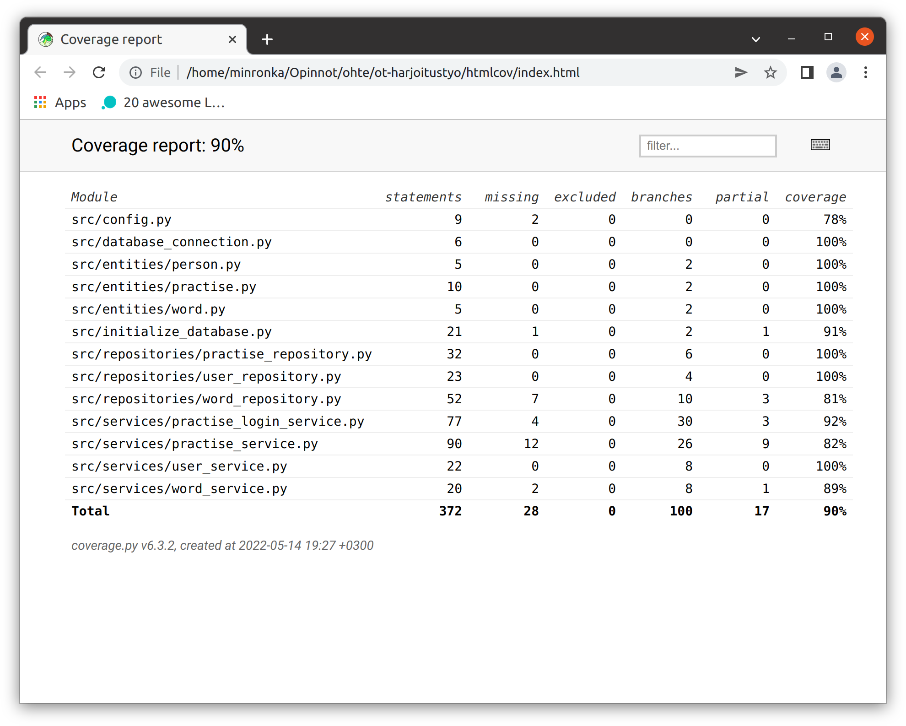

# Testausdokumentti

Ohjelmaa on testattu automaattisilla unittest -yksikkö ja integraatiotesteillä, sekä manuaalisesti järjestelmätasoisesti.

## Yksikkö ja integraatiotestaus

### Sovelluslogiikka

Sovelluslogiikasta vastaavia, services -hakemiston luokkia, testataan testikansion services -hakemistosta löytyvillä testiluokilla: 
- **lisää linkit: TestPractiseService** , testaa 'PractiseService' -luokkaa
- **TestPractiseLoginService** , testaa 'PractiseLoginService' -luokkaa
- **TestUserService** , testaa 'UserService' -luokkaa
- **TestWordService** , 'testaa WordService' -luokkaa
Testeissä käytetään riippuvuuksien käsittelyyn pääasiassa Mock -olioita.
PractiseService -luokassa käytössä FakeRepository -luokka harjoiteltavien sanaparien tuomiseksi testeihin.

### Repositorio -luokat

Repositorioita, jotka löytyvät repositories -hakemistosta, testataan testikansion repositories -hakemistosta löytyvillä testiluokilla: **TestUserRepository**, **TestUserRepository**, **TestWordRepository**. Testeissä on käytössä ainoastaan testiluokan setUp -metodissa tietokantaan tallennettu syöte.

### Testauskattavuus

Käyttöliittymäkerrosta lukuunottamatta sovelluksen testauksessa haarautumakattavuus on 90%.

## Järjestelmätestaus

sovelluksen järjestelmätestaus suoritettiin manuaalisesti.

### Asennus ja konfigurointi

Sovellus on haettu ja sitä on testattu [käyttöohjeen](./kayttoohje.md) kuvaamalla tavalla Linux -ympäristössä.

### Toiminnallisuudet

Kaikki [määrittelydokumentin](./vaatimusmaarittely.md) ja käyttöohjeen listaamat toiminnallisuudet on käyty läpi.
Tarkistettiin myös, että syötekentille määritellyistä vaatimuksista poikkeava syöte aiheuttaa virheilmoituksen.
Sovelluksen syötteiden vaatimuksissa on määritelty:
rekisteröityminen -näkymässä
- tunnuksen tulee olla pituudeltaan 2-20 merkkiä ja tunnus on uniikki
- salasanakenttien salasanat vastaavat toisiaan, mikäli sellainen on annettu
Kirjautuminen -näkymässä
- tunnus on olemassa tietokannassa
- salasana annetaan, jos sellainen on annettu rekisteröitymisen yhteydessä
sanojenlisäys -näkymässä
- valitut kielet poikkeavat toisistaan
- sanalistat eivät ole eripituiset, muuten käyttäjä voi täyttää sanakentät haluamillaan merkeillä täysin vapaasti.
harjoittelunäkymässä
- valitaan ensin yksi vasemmanpuoleisista sanoista
