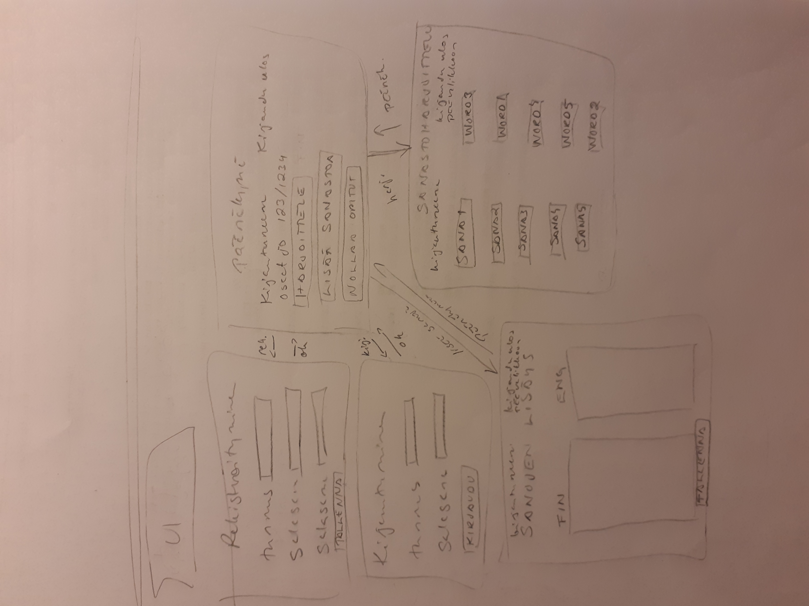

# Vaatimusmäärittely

## Sovelluksen tarkoitus

Sovelluksen avulla käyttäjä voi helposti opetella vieraskielistä sanastoa. Kirjautunut käyttäjä voi tallentaa oman edistymisensä ja jatkaa harjoitteluaan myöhemmin. Kirjautunut käyttäjä voi myös lisätä sanoja sanastoon.

## Käyttäjät

Alkuvaiheen perusversiossa on vain identtisillä käyttäjäoikeuksilla olevia käyttäjiä. 
Sovelluksen jatkokehityksessä sovellukseen lisätään myös järjestelmänvalvojia ja korkeimmilla oikeuksilla toimiva pääkäyttäjä.

## Käyttöliittymäluonnos

Sovelluksessa on viisi näkymää
- päänäkymä
- sanaston harjoittelu
- sanaston lisäys
- kirjautuminen
- rekisteröityminen

**Sovellus aukeaa päänäkymään**, josta voi siirtyä kirjautumisnäkymään, rekisteröitymisnäkymään tai sanaston harjoittelu -näkymään.  
Kirjautumisen jälkeen käyttäjä siirretään päänäkymään, josta kirjautunut käyttäjä voi siirtyä sanaston harjoittelu -näkymään tai sanaston lisäys -näkymään. 
Päänäkymästä, sanaston harjoittelu -näkymästä ja sanaston lisäys -näkymästä voi sovelluksesta kirjautua ulos, jolloin käyttäjä siirretään päänäkymään.

## Perusversion toiminnallisuus

### Ennen kirjautumista

**Käyttäjä voi**
- harjoitella sanastoa ilman edistymisen tallentamista (tehty)
- rekisteröityä sovelluksen käyttäjäksi luomalla tunnuksen ja halutessaan myös salasanan (tehty)
    - tunnuksen pituuden tulee olla 2 - 20 merkkiä ja sen tulee olla uniikki (tehty)
    - salasana ei ole pakollinen (tehty)
    - mikäli salasana on annettu, se vaaditaan käyttäjän kirjautuessa (tehty)
- kirjautua sovellukseen (tehty)
    - kirjoittamalla luomansa tunnuksen ja mahdollisen salasanan kirjautumislomakkeelle (tehty)
    - jos käyttäjän syöttämää tunnusta ei löydy tai salasana on virheellinen, ilmoitetaan se käyttäjälle (tehty)

### Kirjautumisen jälkeen

**Käyttäjä voi**
- lisätä sanoja sanastoon (tehty)
- harjoitella sanaston sanoja (tehty)
- seurata edistymistään sanojen oppimisessa lukumäärätasolla (tehty)
- tallentaa harjoittelun edistymisen (tehty)
- resetoida tallennetun edistymisen ja harjoitella uudelleen (tehty)
- kirjautua ulos sovelluksesta (tehty)

### Jatkokehitysideoita

**Perusversioon lisättäviä toiminnallisuuksia**
- sanojen priorisointi sanaston sisällä
- lisätiedon liittäminen sanoihin
- tarkempi sanojen oppimisen seuraaminen sanatasolla
- erilaisia sanastoja teemoittain ja käyttäen useita kieliä
- käyttäjän henkilökohtainen sanasto, jota voi muutella, rajoittaa näkyvyyttä muille käyttäjille ja jonka voi poistaa
- käyttäjän omien ja muiden käyttäjien sanastojen harjoittelu käyttäjän valitsemassa laajuudessa
- tarkempi oman harjoittelun edistymisen poisto käyttäjän haluamalta osin, myös sanatasolla
- sanaston käyttö sanakirjana
- sanojen lisäys muistilistalle myöhempää sanastoon lisäystä varten
- uuden sanaston lataus csv -tiedostosta
- järjestelmänvalvoja, joka voi resetoida käyttäjän salasanan ja rajoittaa käyttäjän sanastojen näkyvyyttä muille käyttäjille
- pääkäyttäjä voi poistaa käyttäjän ja käyttäjän sanastot
- lopullinen versio voisi olla kollektiivinen web -sovellus puoliautomaattisella sanaston valvonnalla
